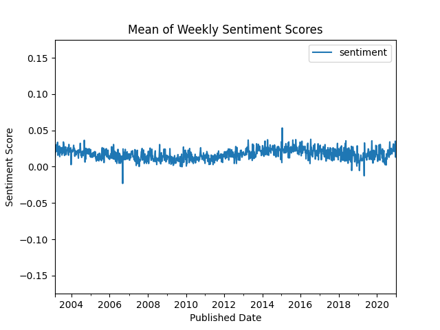
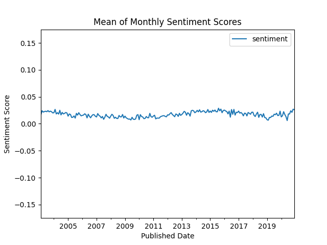
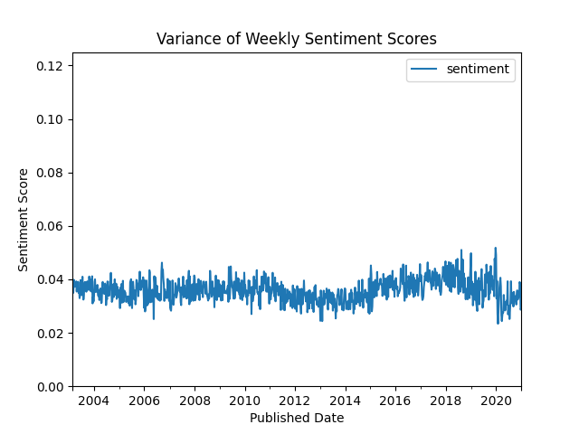
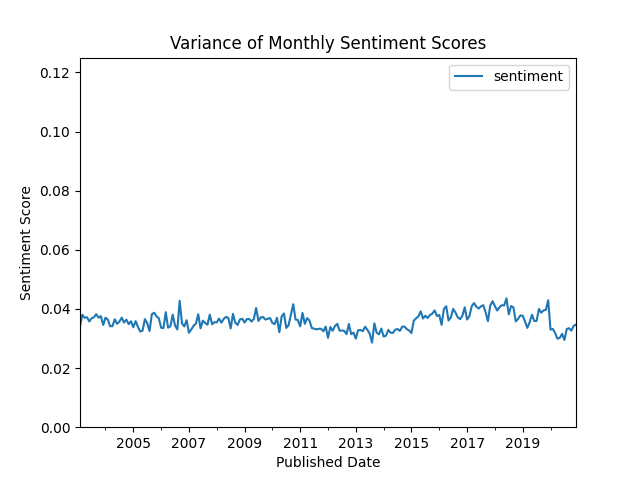
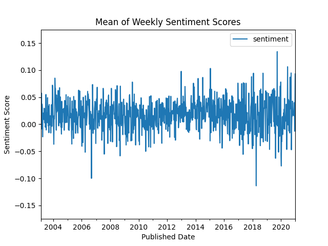
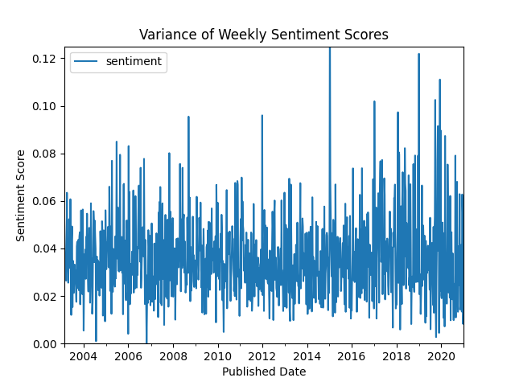

---
output:
  word_document: default
  html_document: default
---
Assignment 3 - Sentiment Analysis
==============================
**Peter Thramkrongart and Jakub Raszka**

##	Github link

Link to the repository: https://github.com/PeterThramkrongart/cds-language-portfolio.git

Link to the assignment folder: https://github.com/PeterThramkrongart/cds-language-portfolio/tree/main/assignments/assignment-3

## Contribution

Both Peter Thramkrongart and Jakub Raszka contributed equally to every stage of this project from initial conception and implementation, through the production of the final output and structuring of the repository. (50/50%)

##  Description

This is a [dataset of over a million headlines](https://www.kaggle.com/therohk/million-headlines) taken from the Australian news source ABC (Start Date: 2003-02-19 ; End Date: 2020-12-31). The task is to:

- Calculate the sentiment score for every headline in the data. You can do this using the spaCyTextBlob approach that we covered in class or any other dictionary-based approach in Python.
- Create and save a plot of sentiment over time with a 1-week rolling average
- Create and save a plot of sentiment over time with a 1-month rolling average
- Make sure that you have clear values on the x-axis and that you include the following: a plot title; labels for the x and y axes; and a legend for the plot
- Write a short summary (no more than a paragraph) describing what the two plots show. You should mention the following points: 1) What (if any) are the general trends? 2) What (if any) inferences might you draw from them?


## Methods

We used SpacyTextBlob and Spacy to extract a 1-month and 1-week rolling averages and variance. Spacy and its pre-trained model [en_core_web_sm](https://spacy.io/models/en) to pre-process the headlines. Then we used the spacytextblob pipeline which utilizes Textblob package and returns a polarity value in the range of -1 to 1.


Originally, we were using a 2.3.2 version of Spacy which was considerably slower compared to the Spacy >= 3.0.0. For the final version of this project, we used the newest version of spacy available (spacy==3.0.6) and spacytextblob (spacytextblob==3.0.1). This allowed us to use the nlp.pipe() method instead, which can distribute the workload in mini-batches. It additionally allows the calculations to be made in parallel to increase speed dramatically. Initially, we used the default model pipeline, but we chose to disable named entity recognition, as we assume that only names like Voldemort and Hitler are going to influence the score if at all. We, therefore, deemed NER unnecessary and slow. That warranted a 20% increase in speed. Originally, we only able to run the project on less than 1/20th of the dataset, but after our improvements, we are now able to utilize the whole dataset. Using all data and all available processing power on worker2 it takes about 14 minutes to run the project. 

We saved the resulting figures with the matplotlib.

Because this project uses Spacy's nlp.pipe() method for the processing, the progress bar is a bit weird. That is the cost of mini-batches and parallelization. If you monitor the machine with ```htop ```, you can see that the machine is indeed working and not stuck.

## Results

__Weekly and monthly mean sentiments scores based on the full dataset:__

{width=300} {width=300}

Looking at the monthly and weekly mean scores we see that the general sentiment of ABC news seems to be ever so slightly positive and without much fluctuation. There does seem to be a slight overall drift in the shape of a very flat sine wave with about 10-year cycles. That being said the curve is so flat and we know so little about the field, that we don't know if this pattern is strong enough to be significant. We also see two distinct spikes in sentiment on the weekly timeline. One negative spike in late 2007 and one positive spike in early 2015. This gets completely smoothed out in the monthly plot. We wonder whether it would be useful to apply some sort of low pass filter to rule out noise and make it easier to find seasonal patterns.

__Variance of weekly and monthly sentiments scores based on the full dataset:__

{width=300} {width=300}

The variance of sentiments seems to be fairly low and quite stable through the sampled period. Unsurprisingly, The size of the rolling window greatly affects the variance. It seems to only smooth the local variance, but the general trends seem to be strong enough to stay using weekly windows. We see a general small dip in variance around the period between 2011 to 2014 and follow by a seemingly equally proportioned increase in the years afterward. Similarly to the mean sentiment scores, we don't know enough about the fields to conclude whether these results are significant or not.


__Variance of weekly sentiments scores based on the full 50000:__

{width=300} {width=300}

Sample size seems to highly influential on the readability as well as the reliability of the analysis. We consider it very difficult to conclude anything from our original plots based on 50000. We, of course, see a huge increase in variance, and an uncountable amount of spikes compared to the full sample size.


## Reproducibility

**Step 1: Clone repository**  

- Open a Linux terminal

- Navigate the destination of the repository

- Run the following command:  

```console
 git clone https://github.com/PeterThramkrongart/cds-language-portfolio.git
``` 

**step 2: Run bash script:**  
- Navigate to the folder "assignment-3".  
```console
cd assignments/assignment-3
```  
- We have written a bash script _sentiment_analysis.sh_ to set up a virtual environment, run the python script, save the plots, and kill the environment afterwards:  
```console
bash sentiment_analysis.sh
```  
By default, the bash script runs the analysis on all the data and uses all available cores. This may not by an option for you. Therefore, you have to run the analysis manually:

**Step 1: Clone repository**  

- Open a Linux terminal

- Navigate the destination of the repository

- Run the following command:

```console
 git clone https://github.com/PeterThramkrongart/cds-language-portfolio.git
``` 

**step 2: Set up the environment and activate it:**  

- Navigate to the folder "assignment-3":

```console
cd assignments/assignment-3
```  
- We have written a bash script _create_sentiment_analysis_venv.sh_ to set up a virtual environment: 

```console
bash create_sentiment_analysis_venv.sh

source sentiment_analysis_venv/bin/activate
```  

**step 3: run the python script:**  

- Navigate to the folder "src":

```console
cd src
```  
- Run the python script _sentiment_analysis.py_ and specify the number of cores to use in integers and the number of samples to use:  

```console
python sentiment_analysis.py -c {number of cores} -s {number of samples}
```  

**step 4 (optional): kill the environment:**  

- Navigate to the folder "assignment-3":

```console
cd ..
```  

- Run the bash script _kill_sentiment_analysis_venv.sh_ to remove the virtual environment:  

```console
bash kill_sentiment_analysis_venv.sh
```

## Running the project on something else than Linux

Our projects are mainly made for Linux/mac users. Our python scripts should run on any machine, though our bash scripts may not work. For this case, we recommend using the [Anaconda](https://www.anaconda.com/python) distribution system to setup environments using our requirements.txt files. We have heard about people having problems with networkx and matplotlib on Windows machines, so this specific script might not run as intended on Windows.