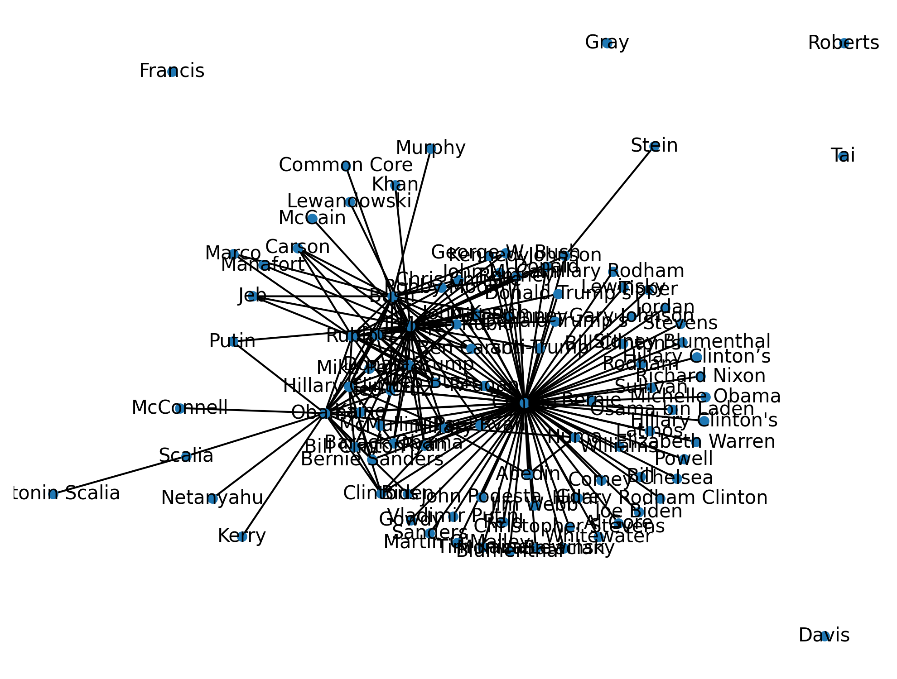
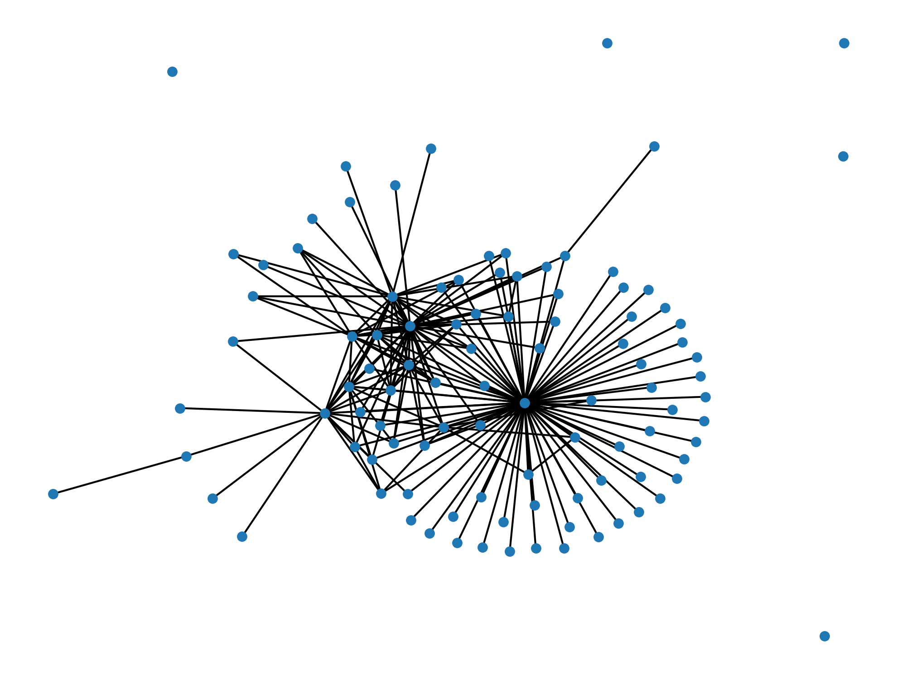

Assignment 4 - Network Analysis
==============================
**Peter Thramkrongart and Jakub Raszka**

##	Github link

Link to the repository: https://github.com/PeterThramkrongart/cds-language-portfolio.git

Link to the assignment folder: https://github.com/PeterThramkrongart/cds-language-portfolio/tree/main/assignments/assignment-4

## Contribution

Both Peter Thramkrongart and Jakub Raszka contributed equally to every stage of this project from initial conception and implementation, through the production of the final output and structuring of the repository. (50/50%)

##  Description

The purpose of this assignment is to create a reusable network analysis pipeline.This command-line tool will take a given dataset and perform simple network analysis. In particular, it is supposed to build networks based on entities appearing together in the same documents and create its visual representation. The script should:

-  be able to be run from the command line
- take any weighted edgelist as an input, providing that edgelist is saved as a CSV with the column headers "nodeA", "nodeB"
- create a network visualization, which will be saved, for any given weighted edgelist given as an input.
- create a data frame showing the degree, betweenness, and eigenvector centrality for each node.

## Methods

By default, the script runs on an edgelist created by taken from the real headlines from the "real or fake news" dataset from kaggle (https://www.kaggle.com/rchitic17/real-or-fake). To create the network graph, the script network_analysis.py_ expects the data to be in a csv format with three columns: _nodeA_, _nodeB_, _weight_. To achieve so, we extracted only the entities tagged as _person_ the named entity recognition from the natural language processing library Spacy's pipeline. Using python's build in modules, we then counted the co-occurrences of each possible pair of persons.

Because our code for creating the edge list uses Spacy's nlp.pipe() method for the processing, the progress bar is a bit weird. That is the cost of mini-batches and parallelization. If you monitor the machine with ```htop ```, you can see that the machine is indeed working and not stuck.

The script for performing the network analysis prunes the network by filtering out connections weaker than the specified threshold. If specified, it plots the network using the python libraries _networkx_ and _matplotlib_. We have heard about people having problems with networkx and matplotlib on Windows machines, so this specific script might not run as intended on Windows.

The script uses _networkx_ to calculate degree, betweenness, and eigenvector centrality for each node.

## Results

With our data, we see a clearly defined cluster around "Clinton", where many nodes only connect to "Clinton". We also see small, but much more interconnected, clusters around "Trump","Bush","Obama" and a couple of others. All clusters seem to be connected to each other forming a big clusters with four non-connected outliers. We assume, that the "Clinton"-cluster has taken the center role, partly because it actually refers to 2 very prominent figures instead of just one. We see small but similar cases with "Bush" and "Obama". We think the difference between "Clinton" and the other cases is that both Hillary and Bill Clinton have had very long, prominent and powerful careers in politics compared to Michelle Obama and Jeb Bush. This artifact seems be be caused by the named entity recognition as it doesn't assign full names to the last name, and vice versa, thereby, creating an overlap.

Below are the top 20 entries sorted by their degree of centrality, and plots of the network with and without labels:

    | I |node            |    degree| betweenness| eigenvector|
    |--:|:---------------|---------:|-----------:|-----------:|
    |  7|Clinton         | 0.8080808|   0.7087182|   0.4704822|
    |  4|Trump           | 0.4141414|   0.1559565|   0.3615150|
    | 11|Bush            | 0.2222222|   0.0607099|   0.2536758|
    |  1|Obama           | 0.2121212|   0.1048255|   0.2363120|
    | 26|Rubio           | 0.1717172|   0.0182101|   0.2306703|
    |  2|Donald Trump    | 0.1515152|   0.0026455|   0.2282180|
    |  3|Hillary Clinton | 0.1515152|   0.0026816|   0.2226510|
    |  8|Cruz            | 0.1515152|   0.0050122|   0.2231035|
    |  9|Hillary         | 0.1111111|   0.0054138|   0.1439408|
    |  5|Ted Cruz        | 0.0909091|   0.0002061|   0.1784693|
    | 27|Marco Rubio     | 0.0707071|   0.0000000|   0.1463659|
    | 43|Clintons        | 0.0707071|   0.0000412|   0.0957748|
    | 19|Jeb Bush        | 0.0606061|   0.0000000|   0.1329436|
    | 22|Ryan            | 0.0606061|   0.0000687|   0.0918729|
    | 29|Romney          | 0.0606061|   0.0000000|   0.0955171|
    | 37|Carson          | 0.0606061|   0.0000000|   0.0869331|
    | 14|Bill Clinton    | 0.0505051|   0.0002396|   0.1042946|
    | 18|Barack Obama    | 0.0505051|   0.0000000|   0.1142554|
    | 41|Johnson         | 0.0505051|   0.0191713|   0.0680789|
    | 83|Abedin          | 0.0505051|   0.0000000|   0.0543916|




## Reproducibility

**Step 1: Clone repository**  

- Open a Linux terminal

- Navigate the destination of the repository

- Run the following command  

```console
 git clone https://github.com/PeterThramkrongart/cds-language-portfolio.git
``` 

**step 2: Run bash script:**  

- Navigate to the folder "assignment-4"

```console
cd assignments/assignment-4
```  
- We have written a bash script _network_analysis.sh_ to set up a virtual environment, run the python script, save the plot, and kill the environment afterwards:  

```console
bash network_analysis.sh
```  
By default, the script runs on an edgelist created by taken from the real headlines from the "real or fake news" dataset from kaggle (https://www.kaggle.com/rchitic17/real-or-fake). If you want to run the script manually, you can do as follows:  

**Step 1: Clone repository**  

- Open a Linux terminal

- Navigate the destination of the repository

- Run the following command  

```console
 git clone https://github.com/PeterThramkrongart/cds-language-portfolio.git
``` 

**step 2: Set up the environment and activate it:**  

- Navigate to the folder "assignment-4" 

```console
cd assignments/assignment-4
```  
- We have written a bash script _create_network_analysis_venv.sh_ to set up a virtual environment: 

```console
bash create_network_analysis_venv.sh

source network_analysis_venv/bin/activate
```  

**step 3: run the python script:**  

- Navigate to the folder "src".  

```console
cd src
```  

- Run the python script _network_analysis.py_ and specify the desired arguments:


    flags: -i, --input_file,   default: ../data/interim/edges_df                         description: str,
                                                                                         path to the input_file,
                                                                                         
    flags: -o, --output_file:  default: ../data/processed/measures_of_centrality.csv,    description: str,
                                                                                         path to output_file
                                                                                         
    flags: -t, --threshold:    default: 500,                                             description: int,
                                                                                         the minimum weight  threshold

    flags: -l, --graph_labels: default: False,                                           description: bool,
                                                                                         whether to plot labels or not
                                                                                         
                                                                                         
    flags: -p, --plot_network: default: False,                                           description: bool,
                                                                                         whether to plot  the network
                                                                                         or not
                                                                                         
    flags: -pf, --plot_file:   default: ../report/figures/network_visualization.png,     description: str,
                                                                                         path to plot_file
    
    
    
    examples:
    
      python network_analysis.py -p -l -t 1500 -pf ../reports/figures/network_visualization_threshold_1500.png
      
    When using boolean flags, just leave them empty.


 ```console
python network_analysis.py -p -l
```

**step 4 (optional): kill the environment:**  

- Navigate to the folder "assignment-4"

```console
cd ..
```  

- Run the bash script _kill_network_analysis_venv.sh_ to remove the virtual environment:  

```console
bash kill_network_analysis_venv.sh
```  

## Running the project on something else than Linux

Our projects are mainly made for Linux/mac users. Our python scripts should run on any machine, though our bash scripts may not work. For this case, we recommend using the python distribution system from https://www.anaconda.com/ to setup environments using our requirements.txt files. We have heard about people having problems with networkx and matplotlib on Windows machines, so this specific script might not run as intended on Windows.
Project Organization
------------
The folder structure of our projects is based on a simplified version of the cookiecutter datascience folder structure https://drivendata.github.io/cookiecutter-data-science/. For the sake of generalizability, some folders will remain empty in some projects but overall this will make folder navigation easier.


    ├── LICENSE
    ├── README.md          <- The top-level README for developers using this project.
    ├── data
    │   ├── interim        <- Intermediate data that has been transformed.
    │   ├── processed      <- The final, canonical data sets for modeling.
    │   └── raw            <- The original, immutable data dump.
    │
    ├── models             <- Trained and serialized models, model predictions, or model summaries
    │
    ├── utils              <- utility scripts with reusable functions and classes
    |  └──__init__.py      <- Makes utils a Python module
    |
    ├── notebooks          <- Jupyter notebooks. Naming convention is a number (for ordering),
    │                         the creator's initials, and a short `-` delimited description, e.g.
    │                         `1.0-jqp-initial-data-exploration`.
    ├── references         <- Data dictionaries, manuals, and all other explanatory materials.
    |
    ├── reports            <- Generated analysis as HTML, PDF, LaTeX, etc.
    │   └── figures        <- Generated graphics and figures to be used in reporting
    |
    ├── requirements.txt   <- The requirements file for reproducing the analysis environment, e.g.
    │                         generated with `pip freeze > requirements.txt`
    │
    └── src                <- Source code for use in this project.
    └── __init__.py    <- Makes src a Python module
--------

