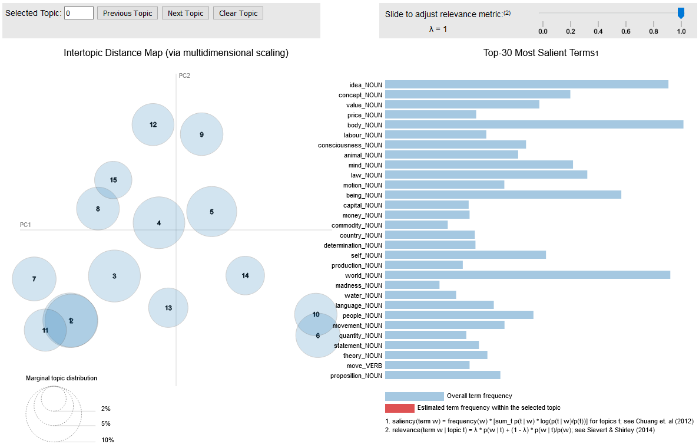
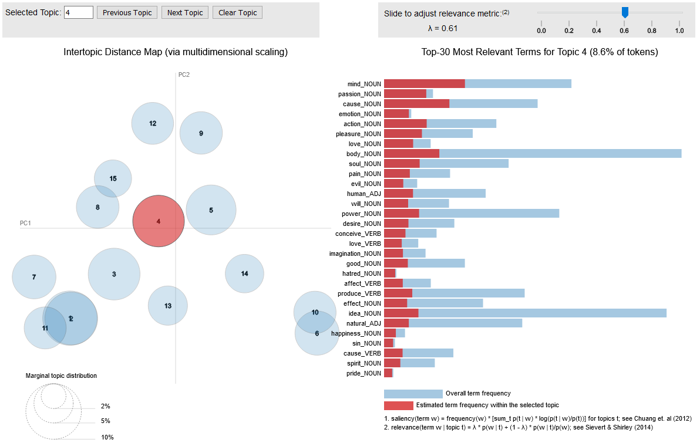

---
output:
  word_document: default
  html_document: default
---
Assignment 5 -Unsupervised machine learning
==============================

**Peter Thramkrongart and Jakub Raszka**

##	Github link

Link to the repository: https://github.com/PeterThramkrongart/cds-language-portfolio.git

Link to the assignment folder: https://github.com/PeterThramkrongart/cds-language-portfolio/tree/main/assignments/assignment-5

## Contribution

Both Peter Thramkrongart and Jakub Raszka contributed equally to every stage of this project from initial conception and implementation, through the production of the final output and structuring of the repository. (50/50%)

##  Description

The task in this assignment is to train an LDA model on your data to extract structured information that can provide insight into your data. For example, maybe you are interested in seeing how different authors cluster together or how concepts change over time. You should:

- formulate a short research statement explaining why you have chosen this dataset and what you hope to investigate
- train an LDA model
- evaluate model's output and your research statement

### Research statement:

We didn’t know much about western philosophy so we wanted to investigate what major philosophical topics have been discussed throughout time. We used the [History of Philosophy](https://www.kaggle.com/kouroshalizadeh/history-of-philosophy) dataset that contains over 300,000 sentences from 51 texts spanning 11 schools of philosophy. The represented schools are: Plato, Aristotle, Rationalism, Empiricism, German Idealism, Communism, Capitalism, Phenomenology, Continental Philosophy, Stoicism, and Analytic Philosophy. We don't know the schools very well, but in this project, we assume that they together as a whole have discussed many of the same topics but with differing viewpoints over time. For this project, we used the probabilistic, unsupervised learning method latent Dirichlet allocation to attempt to allocate the words of the text into major topics of western philosophy.

The data used for the pre-processing and modeling can be found in the _assignments/assignment-5/data/interim/_ called _small_dataset.csv_. It was created from the data linked above by trimming some columns as we had no need of them and we could get around Github LFS.


## Methods

__Preprocessing pipeline__

The pre-processing pipeline consists of 3 major steps.    
First, we loaded the data as sentences and collapsed them into large text strings of individual books.  
Second, we divided the texts into chunks of 2000 tokens for easier modeling. The chunk size of 2000 tokens was chosen as a balance between strain on memory or CPU, sufficient context to words, and reasonable computational time.  

Third, we removed stopwords and then tokenized, lemmatized, and pos-tagged the texts using a modified version of Ross' function for pre-processing with spaCy. We chose to only consider nouns, adjectives, and verbs, and to disregard n-grams entirely. This was because this analysis was about the major concepts and topics in philosophy and not the major individuals or places. We, therefore, don't expect n-grams to be of much use for us. Lastly, we chose to bind lemmas to their POS-tag to aid comprehension of the models and to attempt to individualize homonyms(words that are spelled the same way but have multiple meanings like the word "show").

Because this project uses Spacy's nlp.pipe() method for the processing, the progress bar is a bit weird. That is the cost of mini-batches and parallelization. If you monitor the machine with ```htop ```, you can see that the machine is indeed working and not stuck.

__Modeling__

We modeled our data using Gensim's LDA-algorithm. We fit the model to 15 topics with 1000 iterations and 10 passes. We set the gamma threshold to 0.005 to stop the model earlier when it stopped improving more than the threshold. Each text chunk (that originally consisted of 2000 words each before pre-processing) was treated as a separate document. Lastly, we computed a coherence score and perplexity to evaluate the model's performance.

## Results

In total, the whole pipeline took a little less than 8 minutes to run on worker2. We decided on a model with 15 topics because that seemed to be the maximum number of topics we could fit while still being sufficiently distinct and human interpretable. the Coherence Score was 0.55 and Perplexity was -7.36. 

We interpret the topic to be as follows:

1) Phenomenology and consciousness  
2) Scientific methods and logic  
3) Rhetorical elements of philosophical discussion  
4) The emotions and mental states of human life.  
5) Morality in society  
6) Finance , commodities and market powers  
7) Reality, perception, and imagination  
8) Destiny  
9) The industrialized world  
10) Cognition  
11) Medicine and biology  
12) The elements and the natural world
13) Justice and legislation  
14) Ideologies of economy and society  
15) Perception  

In our view, this model largely sums up the philosophical topics we have heard about. We would have expected the the topic of ethics to be a single distinct topic, but in our model that does not seem to be the case. Rather, It is tangled to topics 4,5,8, and 13.

This project mainly ordered texts by titles. This was because we don't know that much about philosophy, to begin with. To further the project, we could attempt to find out what schools and authors are related to each topic. 

Here are some screen shots of the interactive plots created with [LDAvis](https://github.com/cpsievert/LDAvis). The plots are available at _reports/figures/philosophy_LDAvis.html_. You can open it in an internet browser and explore the different topics. We recommend starting with the relevance slider at 0.6.


{width=1000}
{width=1000}


## Reproducibility

**Step 1: Clone repository**

- Open a Linux terminal

- Navigate the destination of the repository

- Run the following command  

```console
 git clone https://github.com/PeterThramkrongart/cds-language-portfolio.git
``` 

**step 2: Run bash script:**

- Navigate to the folder "assignment-3".  

```console
cd assignments/assignment-5
```  
- We have written a bash script _philosophy_LDA.sh_ to set up a virtual environment, run the python script, save the plot, and kill the environment afterward:  

```console
bash philosophy_LDA.sh
```  

## Running the project on something else than Linux

Our projects are mainly made for Linux/Mac users. Our python scripts should run on any machine, though our bash scripts may not work. For this case, we recommend using the python distribution system [Anaconda](https://www.anaconda.com/) to set up environments using our requirements.txt files.