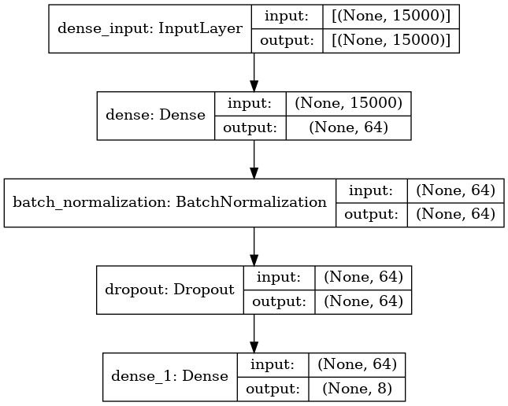
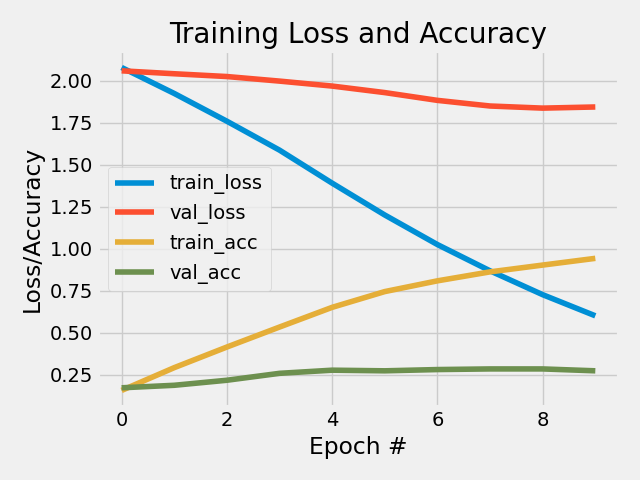

Assignment 6 - Text Classification Using Deep Learning (GoT)
==============================
**Peter Thramkrongart and Jakub Raszka**

##	Github link

Link to the repository: https://github.com/PeterThramkrongart/cds-language-portfolio.git

Link to the assignment folder: https://github.com/PeterThramkrongart/cds-language-portfolio/tree/main/assignments/assignment-6

## Contribution

Both Peter Thramkrongart and Jakub Raszka contributed equally to every stage of this project from initial conception and implementation, through the production of the final output and structuring of the repository. (50/50%)

##  Description

_Winter is coming..._

In this assignment, the we are supposed to use deep learning models like CNNS for classifying a specific kind of cultural data - scripts from the TV series Game of Thrones (https://www.kaggle.com/albenft/game-of-thrones-script-all-seasons). The task is to find out how accurately we can model the relationship between each season and the lines spoken. That is to say - is it possible to predict which season a line comes from? Or to phrase that another way, is dialogue a good predictor of season?

You should:
- build a baseline model with using logistic regression and count vectorization for pre-processing
- build a deep learning model 
- choose the best method for data pre-processing (TFIDF vectorizer, Glove, word2vec)

## Methods
To use dialog as a predictor for originating season, we chose to collapse all dialog from each character per episode. We believe that the classifier needs as much context as possible to predict the originating season, and we don't see how a a sentence or two can be enough for a good prediction. 

For our baseline model, we trained a logistic regression classifier on uni- and bigram-based TFIDF-embeddings using Sci-Kit-Learn.

For a better neural network model, we various advanced architectures using CNNs LSTM layers, batch normalization and dropout. Those models were trained on glove embedded text of various embedding sizes. None seemed to perform nearly as well as our baseline model, that used simple TDIDF embeddings, and none justified the added complexity and computing cost. We therefore ended up building a simple neural network structure using a single densely connected network with 64 nodes, as well as batch normalization and a dropout layer to attempt to keep overfitting as much at bay as possible. 

This was our final neural net architecture:



Because, the performance of our neural network model was far from satisfying, we decided to try a stochastic gradient descent classifier on the same TFIDF-embeddings. We based our decision on the decision tree below by Sklearn. Luckily, training SGD classifiers are fairly fast. We, therefore, used grid search to find the best performing hyper-parameters for the whole modeling pipeline.

These were the hyper-parameters used in the SGD-pipeline grid search:
```python
parameters = {
      'tfidf__ngram_range': [(1, 1), (1, 2),(1,3)],
      'tfidf__max_df': [1.0, 0.95,0.9,0.85],
      'tfidf__min_df': [0.0, 0.05],
      'clf__alpha': [1e-3, 1e-2, 1e-1], # learning rate
      'clf__penalty': ['l2'],
  }
```

How to choose the right classifier engine(From Sci-Kit-Learn): 


## Results

__Baseline model__

The baseline model employing logistic regression achieve 30% accuracy which is above the chance (12.5 %) but far from a good and usable model. 

```
              precision    recall  f1-score   support

    Season 1       0.30      0.44      0.35        32
    Season 2       0.34      0.42      0.37        43
    Season 3       0.20      0.24      0.22        42
    Season 4       0.25      0.18      0.21        39
    Season 5       0.26      0.30      0.28        40
    Season 6       0.33      0.26      0.29        38
    Season 7       0.70      0.44      0.54        16
    Season 8       0.67      0.12      0.20        17

    accuracy                           0.30       267
   macro avg       0.38      0.30      0.31       267
weighted avg       0.33      0.30      0.30       267
```
__Neural Network__

Surprisingly, despite the efforts outlined in the methods, the neural network model had only 27% accuracy. 

```
              precision    recall  f1-score   support

    Season 1       0.35      0.41      0.38        32
    Season 2       0.35      0.30      0.32        43
    Season 3       0.22      0.31      0.25        42
    Season 4       0.18      0.13      0.15        39
    Season 5       0.24      0.30      0.27        40
    Season 6       0.20      0.21      0.20        38
    Season 7       0.71      0.31      0.43        16
    Season 8       0.50      0.24      0.32        17

    accuracy                           0.27       267
   macro avg       0.34      0.28      0.29       267
weighted avg       0.30      0.27      0.28       267

```
As the plot of the history shows, the model overfits dramatically, already at the second epoch. But the validation accuracy still improve for a handful of epochs before it stagnates.

__Stochastic Gradient Descent and grid search__

Our SGD model improved performance slightly and achieved a 34% accuracy. It used the whole vocabulary, implying, that the model relies on named entities and other rare keywords for the classification. Those key words would probably be removed due to rarity if we were to use GLOVE- or word2vec-embeddings. The grid search also found the models with only unigrams and bigrams performed the best, just like we had used before.

```python
The best model hyper parameters: {'clf__alpha': 0.001, 'clf__penalty': 'l2', 'tfidf__max_df': 1.0, 'tfidf__min_df': 0.0, 'tfidf__ngram_range': (1, 2)}
```
Training history of the neural network:



Metrics of the neural network:

```
              precision    recall  f1-score   support

    Season 1       0.29      0.50      0.36        32
    Season 2       0.46      0.40      0.42        43
    Season 3       0.27      0.26      0.27        42
    Season 4       0.30      0.18      0.23        39
    Season 5       0.30      0.30      0.30        40
    Season 6       0.34      0.37      0.35        38
    Season 7       0.52      0.75      0.62        16
    Season 8       0.50      0.18      0.26        17

    accuracy                           0.34       267
   macro avg       0.37      0.37      0.35       267
weighted avg       0.35      0.34      0.34       267
```

__On not using deep learning and advanced embeddings__

For the last implementation of this project, we decided to not to use deep learning at all. We got much better performance using simple TFIDF-embeddings, thereby, rendering deep learning unnecessary. Our deep learning models took way too long to train, and never performed as well as the baseline model. We chose not include any example simple because none were worth the computational time and the time spend on downloading pre-trained embeddings.

We suspect that a transformer model using BERT or something similar may improve the performance, because it will be able to understand the context even better. Our pre-processing collapses dialog into single chunks of text per character per episode. To us this seems like a fairly "fake" classification situation. A BERT model would be better at using a real dialog and, hopefully, rely less on specific keywords. 

In class, it was also discussed that other information may be much useful than dialog as predictors for this classification task. Such features could be "on screen time", length of dialog, mean length per sentence, and so on.

## Reproducibility

**Step 1: Clone repository**  

- Open a Linux terminal

- Navigate the destination of the repository

- Run the following command:  

```console
 git clone https://github.com/PeterThramkrongart/cds-language-portfolio.git
``` 

**step 2: Run bash script**  

- Navigate to the folder "assignment-6":

```console
cd assignments/assignment-6
```  

- We have written a bash script _GOT_classification.sh_ to set up a virtual environment, run the python script, save the plots, and kill the environment afterwards: 

```console
bash GOT_classification.sh
```  
NOTICE! The script uses all available cores for the grid search. It only takes a couple of minutes to run, but beware.


## Running the project on something else than Linux

Our projects are mainly made for Linux/Mac users. Our python scripts should run on any machine, though our bash scripts may not work. For this case, we recommend using the python distribution system from https://www.anaconda.com/ to set up environments using our requirements.txt files.

Project Organization
------------
The folder structure of our projects is based on a simplified version of the cookiecutter data science folder structure https://drivendata.github.io/cookiecutter-data-science/. For the sake of generalizability, some folders will remain empty for some projects, but overall this will make folder navigation easier.


    ├── LICENSE
    ├── README.md          <- The top-level README for developers using this project.
    ├── data
    │   ├── interim        <- Intermediate data that has been transformed.
    │   ├── processed      <- The final, canonical data sets for modeling.
    │   └── raw            <- The original, immutable data dump.
    │
    ├── models             <- Trained and serialized models, model predictions, or model summaries
    │
    ├── utils              <- utility scripts with reusable functions and classes
    |  └──__init__.py      <- Makes utils a Python module
    |
    ├── notebooks          <- Jupyter notebooks. Naming convention is a number (for ordering),
    │                         the creator's initials, and a short `-` delimited description, e.g.
    │                         `1.0-jqp-initial-data-exploration`.
    ├── references         <- Data dictionaries, manuals, and all other explanatory materials.
    |
    ├── reports            <- Generated analysis as HTML, PDF, LaTeX, etc.
    │   └── figures        <- Generated graphics and figures to be used in reporting
    |
    ├── requirements.txt   <- The requirements file for reproducing the analysis environment, e.g.
    │                         generated with `pip freeze > requirements.txt`
    │
    └── src                <- Source code for use in this project.
    └── __init__.py    <- Makes src a Python module
--------
